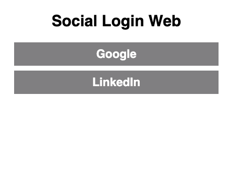

# Social Login Web

This is a sample web application that demonstrates how to use the
[Social Login API](https://developer.okta.com/docs/api/resources/social_authentication.html)
to authenticate users with Google and LinkedIn.

## Prerequisites

- Java 17
- Gradle 7.6
- Set environment variables for:
  - GOOGLE_CLIENT_ID
  - GOOGLE_CLIENT_SECRET
  - LINKEDIN_CLIENT_ID
  - LINKEDIN_CLIENT_SECRET

To create a Google client ID and secret, see
[Create a Google client ID and secret](https://developers.google.com/identity/protocols/oauth2).

To create a Linkedin client ID and secret, see
[Create a LinkedIn client ID and secret](https://developer.linkedin.com/support/faq)
in the authentication tab.

## Screenshot

